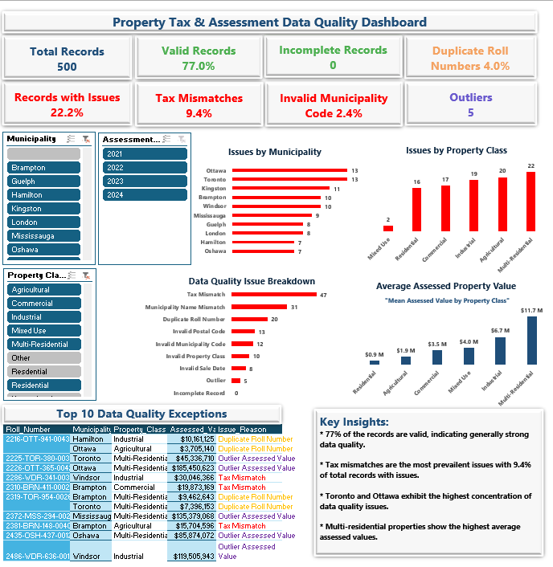

# 📊 Property Tax & Assessment Data Quality Dashboard  
**Identifying Data Quality Risks to Improve Reporting Accuracy and Decision-Making**

---

## 📊 Dashboard Preview



---

## 🚀 Overview

This project analyzes property tax and assessment data to identify data quality issues that can impact reporting accuracy, financial calculations, and decision-making.

Using a structured validation framework, I identified that **22.2% of records contained data quality issues**, including tax mismatches, duplicate entries, and missing values.

> 💡 **Key Insight:** Data quality is not just a technical issue — it is a **business risk** that directly affects decision reliability.

---

## 🎯 Business Problem

Organizations rely on property tax data for:
- Financial reporting  
- Revenue planning  
- Policy and operational decisions  

However, **poor data quality can lead to:**
- Incorrect tax calculations  
- Duplicate or inconsistent records  
- Misinformed business decisions  

---

## 🔍 Objective

To design a **data quality validation framework** that:
- Detects inconsistencies and errors  
- Quantifies data quality issues  
- Improves overall data reliability  

---

## 🧱 Dataset

The dataset contains structured property-level data, including:
- Roll Number (Unique Identifier)  
- Municipality  
- Recorded Tax Amount  
- Calculated Tax Value  
- Property Classification  

---

## 🧰 Analytics Stack

- **Excel** (Core Analysis Environment)
- **Power Query** (ETL / Data Transformation Layer)
- **Pivot Tables** (Metric Aggregation Engine)
- **Excel Dashboards** (Visualization & Reporting Layer)
- **GitHub** (Documentation & Portfolio Hosting)  

---

## 🔍 Data Quality Framework

The following validation checks were implemented:

### 1. Duplicate Detection
- Identified duplicate **roll numbers**
- Prevents overcounting and data redundancy  

### 2. Tax Validation
- Compared **recorded vs calculated tax values**
- Detected inconsistencies in tax calculations  

### 3. Missing Value Checks
- Identified incomplete records  
- Ensured dataset completeness  

### 4. Municipality Validation
- Checked for invalid or inconsistent location entries  

### 5. Data Standardization
- Ensured consistent formats across fields  

---

## 🧪 Validation Logic (Python)

```python
import pandas as pd

df = pd.read_csv("data/processed/cleaned_data.csv")

# Duplicate detection
duplicates = df[df.duplicated(subset=["roll_number"])]

# Missing values
missing = df.isnull().sum()

# Tax mismatch
mismatch = df[df["calculated_tax"] != df["recorded_tax"]]

print("Duplicates:", len(duplicates))
print("Missing Values:\n", missing)
print("Tax Mismatches:", len(mismatch))
```
---

## 📈 Key Findings
- 22.2% of records contained data quality issues
- 9.4% tax mismatches identified
- Duplicate entries detected across records
- Missing values present in key fields

---

## 💼 Business Value

This system demonstrates how raw administrative data can be transformed into a governed analytical asset that supports:

- ✅ Improved revenue forecasting accuracy
- ✅ Better policy decision-making
- ✅ Early detection of data degradation
- ✅ Increased trust in reporting systems
- ✅ Reduced manual data validation effort

> 📌 Key Insight: Data quality issues are not reporting errors — they are decision risks.

---

## 📊 Dashboard Highlights

The dashboard provides:

- Data quality score overview
- Breakdown of issue types
- Tax mismatch analysis
- Duplicate record detection
- Data completeness tracking

---

## ⚠️ Limitations
- Dataset size may limit generalization
- Validation assumes correct reference logic
- No external benchmark dataset used
  
---

## 🔮 Future Enhancements

- 🔄 Automate ETL pipeline (scheduled ingestion)
- 🤖 Introduce anomaly detection using ML models
- 📡 Enable near real-time data quality monitoring
- 🧾 Expand to multi-region property tax benchmarking
- 📊 Add SLA-based data quality thresholds & alerts
  
---

## 📚 Key Learnings
- Designing data quality frameworks from raw administrative data
- Translating technical data issues into business KPIs
- Building monitoring systems instead of static dashboards
- Structuring analytics projects like real data products
- Communicating insights for non-technical stakeholders

---

## 📂 Repository Structure

data/
scripts/
dashboards/
outputs/
docs/
assets/

---

## 📄 Data Dictionary

| Column         | Description                |
| -------------- | -------------------------- |
| roll_number    | Unique property identifier |
| municipality   | Property location          |
| recorded_tax   | Reported tax value         |
| calculated_tax | Expected tax value         |
| property_type  | Classification of property |

---
## 📬 Contact
**Abodunrin Oketade**  
📍 Greater Toronto Area, Ontario, Canada  
🔗 **GitHub:** https://github.com/Richie-Rokka  
🔗 **LinkedIn:** www.linkedin.com/in/abodunrin-oketade

---

⭐ *If you found this project insightful, feel free to star the repository!*
